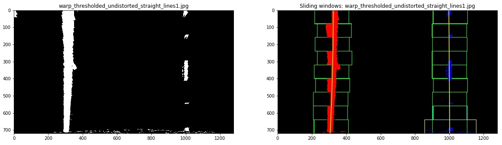
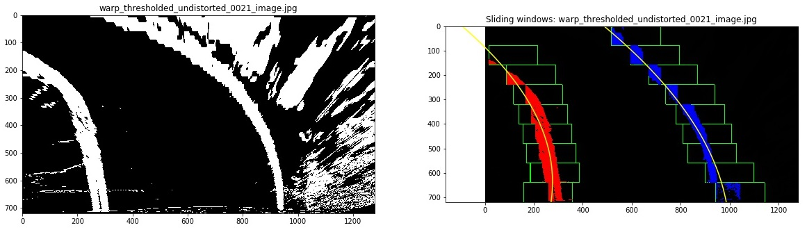

# **Advanced Lane Lines Finding**

## Project2 for Self-Driving Cars Nanodegree @Udacity

<p align="center">
  
</p>

---

## **Overview**

The objective of this project is to build an advanced image processing pipeline for identifying lane lines on the road.

I've considered the following steps to calibrate the camera and build a processing pipeline:
1. Camera calibration: computation of the calibration matrix and distortion coefficients.
2. Distortion correction of raw images.
3. Creation of thresholded binary images: combination of colors selecton and sobel gradient operators
4. Perspective transform to rectify binary images: "birds-eye" view
5. Detection of lane pixels and fit to find the lane boundary
6. Computation of the curvature of the lane and vehicle position with respect to center
7. Warping the detected lane boundaries back onto the original image
8. Output visual display of the lane boundaries and estimation of lane curvature and vehicle position

The main entry point :
- [Pipeline.ipynb](./Pipeline.ipynb) : Jupyter notebook with full step by step implementation of the pipeline and testing on images & videos.


Final results of the videos processing can be found in the folder [output_videos](output_videos/):
* Project Video:
  - [project_video.mp4](output_videos/project_video.mp4)

* Challenge Video:
  - [challenge_video.mp4](output_videos/challenge_video.mp4)

* Harder Challenge Video:
  - [harder_challenge_video.mp4](output_videos/harder_challenge_video.mp4)

[//]: # (Image References)

[orig_cal1]: ./camera_cal/calibration2.jpg "Calibration Image 1"
[corners_cal1]: ./output_images/with_corners_calibration2.jpg "Calibration Image with Corners 2"
[orig_cal2]: ./camera_cal/calibration1.jpg "Calibration Image 2"
[undistorted_cal2]: ./output_images/undistorted_calibration1.jpg "Undistorted Calibration Image 2"
[test_image]: ./test_images/test2.jpg "Calibration Image 2"
[undistorted_test]: ./output_images/undistorted_test2.jpg "Undistorted Calibration Image 2"
[test_image2]: ./output_images/undistorted_00147_image.jpg "Undistorted test inage 2"
[adjusted_test_image2]: ./output_images/adjusted_brightness_undistorted_00147_image.jpg "Adjusted test inage 2"
[white_test_image2]: ./output_images/white_color_undistorted_00147_image.jpg "White Selection test inage 2"
[yellow_test_image2]: ./output_images/yellow_color_undistorted_00147_image.jpg "Yellow Selection test inage 2"
[test_image3]: ./output_images/undistorted_42_image.jpg "Remove Other Colors"
[other_color_test_image3]: ./output_images/other_color_undistorted_42_image.jpg "Remove Other Colors"
[gradient_test_image3]: ./output_images/gradient_undistorted_42_image.jpg "Gradient Detection"
[combined_color_gradient]: ./output_images/thresholded_undistorted_42_image.jpg "Combined Color & Gradient Detection"
[thresholding]: ./images/Thresholding.png "Thresholding"
[test_image4]: ./output_images/undistorted_straight_lines1.jpg "Test Image 4"
[warp_perspective4]: ./output_images/warp_undistorted_straight_lines1.jpg "Warp Perspective 4"
[test_image5]: ./output_images/undistorted_2_image.jpg "Test Image 4"
[warp_perspective5]: ./output_images/warp_undistorted_2_image.jpg "Warp Perspective 4"

[pipeline]: ./images/pipeline.png "Pipeline"
[original]: ./test_images/solidYellowLeft.jpg "Original Image"
[color_selection]: ./test_images_output/1_color_select_solidYellowLeft.jpg "Selection of White/Yellow color"
[gray_scaled]: ./test_images_output/2_gray_scaled_solidYellowLeft.jpg "Gray Scaled"
[blur_grayed]: ./test_images_output/3_blur_grayed_solidYellowLeft.jpg "Noise Reduction"
[edges]: ./test_images_output/4_edges_solidYellowLeft.jpg "Edges Detection"
[edges_region]: ./test_images_output/5_masked_edges_solidYellowLeft.jpg "Region Selection 2"
[rawlines_1]: ./images/LinesYellowLeft.png "raw lines - YellowLeft"
[rawlines_2]: ./images/LinesSolidWhiteRight.png "raw lines - SolidWhiteRight"
[line_ex_1]: ./test_images_output/6_lines_detection_solidYellowLeft.jpg "Extended lines - - YellowLeft"
[line_ex_2]: ./test_images_output/6_lines_detection_solidWhiteRight.jpg "Extended lines - - SolidWhiteRight"
[region_selection]: ./images/region_select_solidYellowLeft.png "Region Selection 1"
[example_widget]: ./images/example_widget.png "Example Interactive Widget"
[road_up_hill]: ./images/road_up_hill.jpg "Example Road Up Hill"

---

## **Processing Steps**

### 1. Camera Calibration

In this step I used 9x6 chessboard images. For each image, I keep track of:
- the coordinates of the chessboard corners in the world, which is assumed to be the same for all images. Coordinates are append to the `objpoints` list.
- the (x, y) pixel position of each of the corners in the image plane where the chessboard has been successfully detection with `cv2.findChessboard`. The position is added to the `imgpoints` list.

The code for this step is contained in the 4th code cell of the IPython notebook.

| Calibration Image | Chessboard corners detected |
| :---: |:---:|
| ![alt text][orig_cal1]  | ![alt text][corners_cal1]  |

`cv2.calibrateCamera()` function is then used to compute the camera calibration matrix and distortion coefficients:
```
ret, mtx, dist, rvecs, tvecs = cv2.calibrateCamera(objpoints, imgpoints, img_size, None, None)
```
This is how the calibration matrix and distortion coefficients are used later to undistort the raw images:
```
undistorted_image = cv2.undistort(image, mtx, dist, None, mtx)
```

| Another Calibration Image | Undistorted Calibration Image |
| :---: |:---:|
| ![alt text][orig_cal2]  | ![alt text][undistorted_cal2]  |

### 2. Building the Pipeline
#### Step 1: Distortion correction
The first step of the pipeline is to undistort the image as described above. See code snippet in 8th code cell of the IPython notebook which use an interactive function to explore the effect on each test image. The following is an example of the result applied to a test image:

| Test Image | Undistorted Test Image |
| :---: |:---:|
| ![alt text][test_image]  | ![alt text][undistorted_test]  |

#### Step 2: Thresholded Binary Image
This step combines color and gradient thresholding techniques.

##### 2.1 Adjusting brightness & contrast
I've noticed the brightness on the images can vary a lot, this is typical in the hardest challenge video. The issue with that is to get fixed color threshold values that can be applied to all images.
The idea I had to somehow overcome that issue is to compute the average luminescence of the image and if it is higher or lower than some threshold values then I increase or decrease the brightness. The contrast is also adjusted by a fixed value.
Threshold values are fixed empirically.
```
# Convert to HLS
hls = cv2.cvtColor(image, cv2.COLOR_RGB2HLS)
mean_lumi = np.mean(hls[:,:,1])

if mean_lumi > 110:
    britghness = (100 - mean_lumi)*1.5
    image = apply_brightness_contrast(image, britghness, 20)
elif mean_lumi < 80:
    britghness = (80 - mean_lumi)*1.5
    image = apply_brightness_contrast(image, britghness, 20)
```
The result looks like the following:

| brighter Image | Adjusted brightness and contrast |
| :---: |:---:|
| ![alt text][test_image2]  | ![alt text][adjusted_test_image2]  |

##### 2.2 Color thresholding
###### 2.2.1 White Color

For white color detection I used an intersection of RGB (all channels) & HLS (only L channel) color spaces. The thresholding values are the results of some trials & errors exercise:
```
RGB_LOW_WHITE = np.array([200, 200, 200])
RGB_UPPER_WHITE = np.array([255,255,255])
HLS_LOW_WHITE = np.array([0, 200, 0])
HLS_UPPER_WHITE = np.array([255,255,255])

# create binary image for white colors
white_rgb_binary = cv2.inRange(image, RGB_LOW_WHITE, RGB_UPPER_WHITE) // 255
white_hls_binary = cv2.inRange(hls, HLS_LOW_WHITE, HLS_UPPER_WHITE) // 255
```
The resulting white mask is based on the intersection `(white_rgb_binary == 1) & (white_hls_binary == 1)`:

| Test Image | Selection of white color |
| :---: |:---:|
| ![alt text][test_image2]  | ![alt text][white_test_image2]  |

###### 2.2.1 Yellow Color
To select yellow color however I only considered `H` and `S` channels of HLS color space. Again threshold values are empiricals.
```
HLS_LOW_YELLOW = np.array([10, 0, 100])
HLS_UPPER_YELLOW = np.array([40, 255, 255])

# create binary image for yellow color
yellow_hls_binary = cv2.inRange(hls, HLS_LOW_YELLOW, HLS_UPPER_YELLOW) // 255
```

| Test Image | Selection of yellow color |
| :---: |:---:|
| ![alt text][test_image2]  | ![alt text][yellow_test_image2]  |

###### 2.2.1 Other uninteresting Colors
One idea I explored was to remove as much as possible pixels with uninteresting colors. For example the road color on the images/video are in large extend close to a nuance of gray and blue. So removing those colors, and any other nuance of unlikely color of interest might help reduce noisiness and eliminate some false detection when using gradient thresholding.
```
HLS_LOW_GRAY = np.array([0, 0, 0])
HLS_UPPER_GRAY = np.array([255, 150, 20])
HLS_LOW_OTHER = np.array([90, 0, 0]) #95
HLS_UPPER_OTHER = np.array([255, 150, 255]) #120

gray_hls_binary = cv2.inRange(hls, HLS_LOW_GRAY, HLS_UPPER_GRAY) // 255
other_hls_binary = cv2.inRange(hls, HLS_LOW_OTHER, HLS_UPPER_OTHER) // 255
```
The following shows the new area of interest after removing uninteresting colors. We can see how it helped remove the area on the road with dark gray color which would have otherwise be detected when using gradient operators.

| Test Image | Partially removing uninteresting colors |
| :---: |:---:|
| ![alt text][test_image3]  | ![alt text][other_color_test_image3]  |

##### 2.3 Gradient thresholding
Here I used a union of :
- sobel directional gradient operators (`sobel x`, `sobel y`):

`def abs_sobel_thresh(image, orient='x', sobel_kernel=3, thresh=(0, 255))` (in 13th cell code)

- grandient magnitude of both sobel directional operators:

`def mag_thresh(image, sobel_kernel=3, mag_thresh=(0, 255))` (in 13th cell code)

The combined gradient (`sobel x` | `sobel y` | `magnitude`) is then intersected with the `other colors` area of interest defined in section `2.2.1` above.
```
# Calculate directional X gradient
sobel_x = abs_sobel_thresh(image, orient='x', sobel_kernel=sobel_kernel, thresh=thresh)
sobel_y = abs_sobel_thresh(image, orient='y', sobel_kernel=sobel_kernel, thresh=thresh)
mag_binary = mag_thresh(image, sobel_kernel=sobel_kernel, mag_thresh=mg_thresh)

combined_sobel = np.zeros_like(sobel_x)
combined_sobel[(sobel_x == 1) | (sobel_y == 1) | (mag_binary == 1)] = 1

# Combined binary threshold
combined_binary = np.zeros_like(sobel_x)
combined_binary[((combined_sobel == 1) & (gray_hls_binary == 0) & (other_hls_binary == 0)) |...]
```
An illustration of the result is provided as following:

| Test Image | Combined Gradient + other colors area |
| :---: |:---:|
| ![alt text][test_image3]  | ![alt text][gradient_test_image3]  |

##### 2.4 Combining all thresholding
Finally all the color and gradient thresholding are combined as shown in the following diagram:
![alt text][thresholding]
The code is implemented by the function `color_gradient_threshold` in the 14th cell code of the IPython notebook.
As example of output:

| Test Image | Combined Gradient + other colors area |
| :---: |:---:|
| ![alt text][test_image3]  | ![alt text][combined_color_gradient]  |

#### Step 3: Perspective Transform
In this step the image is warped to get a bird-eye view of the lane lines of interest.
The function `compute_perspective_transform_matrix` in the notebook computes the perspective transform matrix from source & destination coordinates, while `apply_warp_perspective` function applies the perspective transform to warp an image.
```
def compute_perspective_transform_matrix(src_coords, dst_coords):
    src = np.float32([src_coords[0], src_coords[1], src_coords[2], src_coords[3]])
    dst = np.float32([dst_coords[0], dst_coords[1], dst_coords[2], dst_coords[3]])
    return cv2.getPerspectiveTransform(src, dst)


def apply_warp_perspective(image, M, img_size=IMG_SIZE, flags=cv2.INTER_LINEAR):
    return cv2.warpPerspective(image, M, img_size, flags=flags)
```
I hardcoded some empirical values for source & destination coordinates as following (cell code 17 on the IPython notebook):
```
# Source coordinates
src_coords = [[190, 719], [569, 465], [714, 465], [1126, 719]]

# destination coordinates
dst_coords = [[290, 719], [290, 0], [1026, 0], [1026, 719]]
```
We can see in the following example that the perspective transform works as expected:

| Test Images | Warped Images |
| :---: |:---:|
| ![alt text][test_image4]  | ![alt text][warp_perspective4]  |
| ![alt text][test_image5]  | ![alt text][warp_perspective5]  |

Note that the inverse transform matrix is computed by inversing position of source & destination coordinates in the `compute_perspective_transform_matrix` function.

#### Step 4: Detection of Lane Lines
##### 4.1 Detection of Lane Lines (Image)
Two approaches are use for detecting the lane lines pixels on an image.
###### 4.1.1 Sliding windows search
I used this technique to detect the lane lines when there was not enough previous information of where the lines should be located in the image. The following steps implement the search algorithm:
1. Compute histogram peaks on the lower half of the image: it is likely that the lane lines will be found on the lower part of the image at around the points where we have the left and right peaks of the histogram. (See the interactive function `show_histogram` in cell code 21)
<p align="center">
  
</p>
But when there is too much noise, we might not detect correctly start of the lines. So a better idea I had was to reduce the area where I look for the left and right peaks of the histogram.
<p align="center">
  
</p>

In above figure, the new areas to look for the histogram peaks are under the blue line (lower half of the image) but between the green solid lines. Those areas are centered at the green doted lines (located at x positions `image_width/4` and `3*image_width/4`) with a respective widths of 200px for left area and 250px for right area.
In that example, the magenta dotted lines indicate where we would have located the histogram peaks with the first approach, and we can see the peak on the left side is completely off. But using the new defined area we get the yellow dotted line at the position of the new peak on right side (on left side both yellow and magenta lines are at the position for this example).
The left and right position of the histogram peaks are considered as centers of the starting search windows: `leftx_current` and `rightx_current`.

2. Once the interesting starting positions of the left and right search windows are defined, we loop through each window in `nwindows` (the number of sliding windows to go through from bottom to top of the image) with the following general steps:
  - (a) Find the boundaries of our current window. This is based on a combination of the current window's starting point (leftx_current and rightx_current), as well as the width and height of the window
  - (b) From the boundaries of our window, we find out which activated pixels fall into the window and we keep track of them in the lists `left_lane_inds` and `right_lane_inds`.
  - (c) If the number of pixels you found are greater than a fixed threshold `minpix`, then we re-center our window (i.e. leftx_current or rightx_current) based on the mean position of these pixels.

  <p align="center">
      
  </p>

  The above steps are implemented in cell code 22 of the Jupiter notebook by the function `find_lane_sliding_windows`.

Some edge cases are also handled:
- In the step (c) above, if the number of pixels found is zero then we flag it as miss and increase the counters `left_miss` or `right_miss`. The idea being that if the number of misses is higher than the threshold `max_nissed` (value fixed to 3) then we will stop searching for pixels for that line. This is to avoid detecting later some noise as lane pixels. But when we find some number of pixels higher than the threshold `minpix` then we reset those counters `left_miss` or `right_miss` to zero and increase the counters `left_found` or `right_found`.
- If there is a major difference between the counters `left_found` or `right_found` then we will drop the line with lesser pixels found and compute polynomial curve fit for it that is equidistant to the other line found (see function `search_with_sliding_windows` in cell code 23)

- The following is an illustration of the above points: sliding windows is stopped as we failed to found more pixels for rigth line and a fit line is computed as an equidistant to left line found.
<p align="center">
  
</p>

- Step (c) is further improved by considering that when there is too much noise on the sliding window area then the position of the mean pixels might deviate a lot from the positions of pixels of the line. In such case:
  - For right sliding window, the line is more likely to be on the left side and noise on the right side
  - For left sliding window, the line is more likely to be on the right side and noise on the left side
  - So in step (c) the `leftx_current` and `rightx_current` are computed respectively as mean position of the found pixels in the last quarter of the left sliding window and mean position of the found pixels in the first quarter of the right sliding window.

  The following figure is an illustration of that: you can see how the right sliding windows are avoiding the noise area and capturing instead the pixels of the right line.

  <p align="center">
    
  </p>

###### 4.1.2 Search around polynomial fit line
This approach is used once we have found fitted lane lines from previous image. In this case we don't need to go through the sliding windows search but instead we just look around the fitted lane lines +/- a certain x-margin. This is implemented in cell code 24 in the Jupyter notebook.

The following figures show an example of line detection with sliding windows, followed by a search around the polynomial fitted line.
<p align="center">
  
</p>

##### 4.2 Detection of Lane Lines (Video)
The general idea of detecting lane lines in a Video is as follow (implemented by the function `process_image`, 27th cell code in the IPython notebook):
1. Search for lines pixels on the image:

  - If left line or right line was detected in previous image then:
    - Try to detect lines on current image by `searching the area around the previous polynomial lines fits` and fit the pixels detected into a polynomial curve

  - Else: # (We did not line fits for previous image)
    - Try to detect lines on current image using `sliding search windows` and fit the pixels detected into a polynomial curve


2. Try to fit the pixels detected into a polynomial curve
3. If a line pixels are successfully fitted into a poly curve, then:

  - Sanity check the line to ensure it does not deviate too much from detected lines in previous images

  - If a line passes the sanity check it is flagged as detected and added to the list of detected lines

5. If only one line (left or right) was detected in previous step:

  -  Compute a fit of the missing line as an equidistant curve to the detected line (function `get_parralel_line` in cell code 21)

  - Sanity check the computed equidistant line to ensure it does not deviate too much from detected lines in previous images and flag it as `detected` upon passing the check.

6. For each detected line compute a new average line fit over the n iteration of the detected same line

#### Step 5: Radius of curvature of the lane and vehicle position
- Given the coefficients of polynomial fit curve of a lane line, we can compute the radius of curvature at the vehicle y position (implemented in the utility class `Line` by the functon `_curvature_real`, 26th cell code in the notebook):
```
curverad = np.power(1 + (2*fit[0]*y_eval*ym_per_pix + fit[1])**2, 1.5)/(2*np.abs(fit[0]))
```
The radius of curvature of the lane is then computed as average of the radius of curvature of letf and right lane lines `(LEFT_LINES.best_radius_of_curvature + RIGHT_LINES.best_radius_of_curvature) / 2` (see in cell code 27).

- The position of the vehicle is computed with respect to each line detected (function `_car_pos_from_line` in cell code 26) then averaged for both lines over n iteration in cell code 27.

#### Step 7: Plotting the result back onto the original image
This step is implemented by the function `process_video` in cell code 27. The following is an example of the output.
<p align="center">
  
</p>
